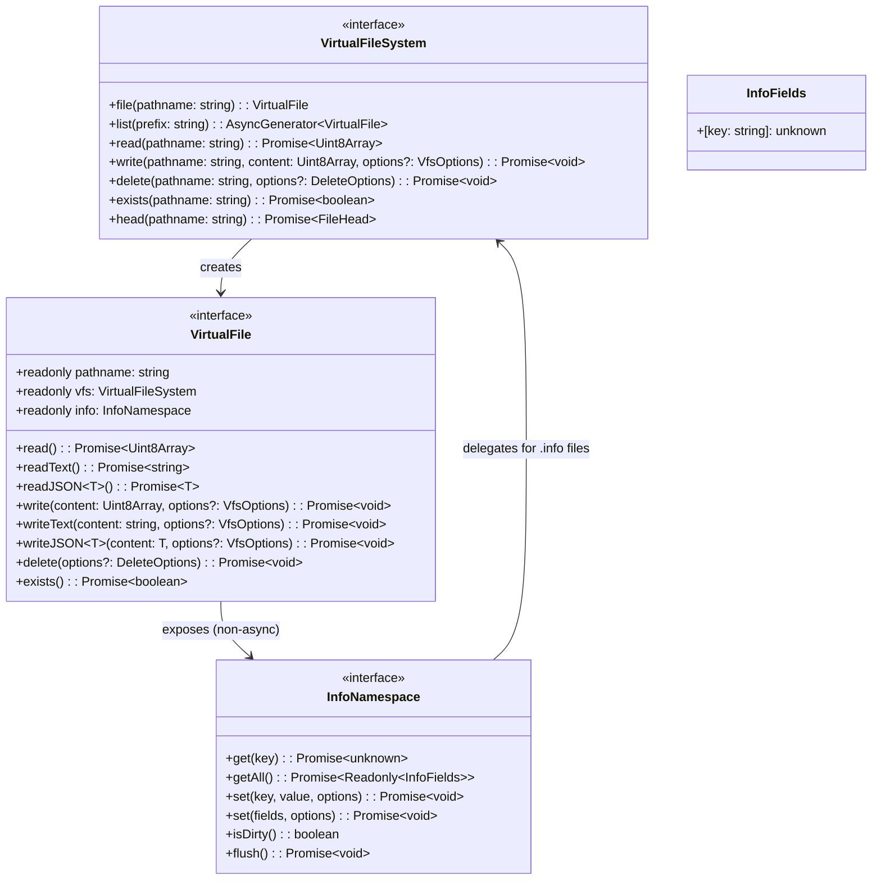

# VFS Architecture Analysis & Redesign Proposal

## Current Architecture Issues

The current design has **state distributed between `GenericFile` and `VirtualFileSystem`**, causing:
- Multiple `VirtualFile` instances for the same pathname have **independent, unsynchronized state**
- Stale data when the same file is accessed through different handles
- Memory leaks from hanging file references with cached state
- Complex state management in `GenericFile` (load/flush/dirty cycle)

---

## Proposed Architecture: Stateless VirtualFile

### Core Principle

```
VirtualFile = Stateless Pointer/Handle
VirtualFileSystem = Content Storage Only
Fields/Metadata = Accessed via file.info (stored in .info files)
```



---

## New Contract Specification

### VirtualFileSystem Interface (Content Only)

```typescript
interface VirtualFileSystem {
  // === File Handle Factory ===
  file(pathname: string): VirtualFile

  // === Content Operations ===
  read(pathname: string): Promise<Uint8Array>
  write(pathname: string, content: Uint8Array, options?: VfsOptions): Promise<void>
  delete(pathname: string, options?: DeleteOptions): Promise<void>

  // === Queries ===
  list(prefix: string): AsyncGenerator<VirtualFile>
  exists(pathname: string): Promise<boolean>
  head(pathname: string): Promise<FileHead>
}

interface VfsOptions {
  flush?: boolean  // Default: true
}

interface DeleteOptions {
  force?: boolean
  recursive?: boolean
}

interface FileHead {
  size: number
  modifiedAt: number
  createdAt: number
}
```

### VirtualFile Interface (Stateless)

```typescript
interface VirtualFile {
  readonly pathname: string
  readonly vfs: VirtualFileSystem

  // === Info Namespace (non-async property) ===
  readonly info: InfoNamespace

  // === Content Operations ===
  read(): Promise<Uint8Array>
  readText(): Promise<string>
  readJSON<T>(): Promise<T>
  
  write(content: Uint8Array, options?: VfsOptions): Promise<void>
  writeText(content: string, options?: VfsOptions): Promise<void>
  writeJSON<T>(content: T, options?: VfsOptions): Promise<void>
  
  delete(options?: DeleteOptions): Promise<void>
  exists(): Promise<boolean>
}
```

### InfoNamespace Interface

```typescript
interface InfoNamespace {
  // === Field Operations (async) ===
  get<K extends string>(key: K): Promise<unknown>
  getAll(): Promise<Readonly<InfoFields>>
  set<K extends string>(key: K, value: unknown, options?: VfsOptions): Promise<void>
  set(fields: Partial<InfoFields>, options?: VfsOptions): Promise<void>

  // === Persistence ===
  isDirty(): boolean
  flush(): Promise<void>
}

interface InfoFields {
  [key: string]: unknown
}
```

---

## Key Benefits

### 1. **Stateless VirtualFile**
`VirtualFile` is a pure pointer. Creating it is instant and non-async:
```typescript
const file = vfs.file('/doc.md')  // No I/O, instant
```

### 2. **Non-Async Info Access**
The `info` property is accessed synchronously from the file:
```typescript
const file = vfs.file('/doc.md')
const title = await file.info.get('title')  // Async data load
await file.info.set('title', 'Hello')       // Async data save
```

### 3. **Info Files Stored Separately**
Fields/metadata are stored in `.info` files alongside the main file:
- `/docs/article.md` - main content
- `/docs/article.md.info` - fields/metadata (JSON)

### 4. **Simpler VFS Implementations**
VFS implementations only handle content. Info operations are built on top using regular VFS operations on `.info` files.

---

## Implementation Plan

### Step 1: Update VirtualFileSystem Interface

**File:** `packages/vfs/src/virtual-file-system.ts`

```typescript
export interface VirtualFileSystem {
  file(pathname: string): VirtualFile
  read(pathname: string): Promise<Uint8Array>
  write(pathname: string, content: Uint8Array, options?: VfsOptions): Promise<void>
  delete(pathname: string, options?: DeleteOptions): Promise<void>
  list(prefix: string): AsyncGenerator<VirtualFile>
  exists(pathname: string): Promise<boolean>
  head(pathname: string): Promise<FileHead>
}

export interface VfsOptions {
  flush?: boolean
}

export interface DeleteOptions {
  force?: boolean
  recursive?: boolean
}

export interface FileHead {
  size: number
  modifiedAt: number
  createdAt: number
}
```

### Step 2: Update VirtualFile Interface

**File:** `packages/vfs/src/virtual-file.ts`

```typescript
export interface VirtualFile {
  readonly pathname: string
  readonly vfs: VirtualFileSystem
  readonly info: InfoNamespace

  read(): Promise<Uint8Array>
  readText(): Promise<string>
  readJSON<T>(): Promise<T>
  
  write(content: Uint8Array, options?: VfsOptions): Promise<void>
  writeText(content: string, options?: VfsOptions): Promise<void>
  writeJSON<T>(content: T, options?: VfsOptions): Promise<void>
  
  delete(options?: DeleteOptions): Promise<void>
  exists(): Promise<boolean>
}

export interface InfoNamespace {
  get<K extends string>(key: K): Promise<unknown>
  getAll(): Promise<Readonly<InfoFields>>
  set<K extends string>(key: K, value: unknown, options?: VfsOptions): Promise<void>
  set(fields: Partial<InfoFields>, options?: VfsOptions): Promise<void>
  isDirty(): boolean
  flush(): Promise<void>
}

export interface InfoFields {
  [key: string]: unknown
}
```

### Step 3: Create VirtualFile Implementation

**New file:** `packages/vfs/src/virtual-file-impl.ts`

```typescript
export class VirtualFileImpl implements VirtualFile {
  readonly pathname: string
  readonly vfs: VirtualFileSystem
  readonly info: InfoNamespace

  constructor(vfs: VirtualFileSystem, pathname: string) {
    this.vfs = vfs
    this.pathname = pathname
    this.info = new InfoNamespaceImpl(this)
  }

  read(): Promise<Uint8Array> {
    return this.vfs.read(this.pathname)
  }

  async readText(): Promise<string> {
    const buffer = await this.read()
    return new TextDecoder().decode(buffer)
  }

  async readJSON<T>(): Promise<T> {
    const text = await this.readText()
    return JSON.parse(text) as T
  }

  write(content: Uint8Array, options?: VfsOptions): Promise<void> {
    return this.vfs.write(this.pathname, content, options)
  }

  async writeText(content: string, options?: VfsOptions): Promise<void> {
    const encoder = new TextEncoder()
    return this.write(encoder.encode(content), options)
  }

  async writeJSON<T>(content: T, options?: VfsOptions): Promise<void> {
    const json = JSON.stringify(content, null, 2)
    return this.writeText(json, options)
  }

  delete(options?: DeleteOptions): Promise<void> {
    return this.vfs.delete(this.pathname, options)
  }

  exists(): Promise<boolean> {
    return this.vfs.exists(this.pathname)
  }
}
```

### Step 4: Create InfoNamespace Implementation

**New file:** `packages/vfs/src/info-namespace-impl.ts`

```typescript
export class InfoNamespaceImpl implements InfoNamespace {
  readonly target: VirtualFile
  private fields: InfoFields = {}
  private dirty = false
  private loaded = false

  constructor(target: VirtualFile) {
    this.target = target
  }

  async get<K extends string>(key: K): Promise<unknown> {
    await this.ensureLoaded()
    return this.fields[key]
  }

  async getAll(): Promise<Readonly<InfoFields>> {
    await this.ensureLoaded()
    return { ...this.fields }
  }

  async set<K extends string>(
    keyOrFields: K | Partial<InfoFields>,
    valueOrOptions?: unknown | VfsOptions,
    maybeOptions?: VfsOptions
  ): Promise<void> {
    await this.ensureLoaded()
    
    if (typeof keyOrFields === 'string') {
      this.fields[keyOrFields] = valueOrOptions
    } else {
      Object.assign(this.fields, keyOrFields)
    }
    this.dirty = true

    const options = typeof keyOrFields === 'string' 
      ? maybeOptions 
      : (valueOrOptions as VfsOptions)
    
    if (options?.flush !== false) {
      await this.flush()
    }
  }

  isDirty(): boolean {
    return this.dirty
  }

  async flush(): Promise<void> {
    if (!this.dirty) return
    
    const infoPathname = `${this.target.pathname}.info`
    const json = JSON.stringify(this.fields, null, 2)
    await this.target.vfs.write(infoPathname, new TextEncoder().encode(json))
    this.dirty = false
  }

  private async ensureLoaded(): Promise<void> {
    if (this.loaded) return
    
    const infoPathname = `${this.target.pathname}.info`
    try {
      const content = await this.target.vfs.read(infoPathname)
      const json = new TextDecoder().decode(content)
      this.fields = JSON.parse(json)
    } catch {
      this.fields = {}
    }
    this.loaded = true
  }
}
```

### Step 5: Update VFS Implementations

Each VFS implementation only needs to handle content operations:

**File:** `packages/vfs-node/src/node-file-system.ts`

```typescript
import { VirtualFileSystem, VirtualFile, VfsOptions, DeleteOptions, FileHead } from '@arxhub/vfs'
import { VirtualFileImpl } from '@arxhub/vfs/virtual-file-impl'
import { join, dirname } from 'node:path'
import fs from 'node:fs/promises'

export class NodeFileSystem implements VirtualFileSystem {
  constructor(private rootDir: string) {}

  file(pathname: string): VirtualFile {
    return new VirtualFileImpl(this, pathname)
  }

  async read(pathname: string): Promise<Uint8Array> {
    const buffer = await fs.readFile(join(this.rootDir, pathname))
    return new Uint8Array(buffer)
  }

  async write(pathname: string, content: Uint8Array, options?: VfsOptions): Promise<void> {
    const filePath = join(this.rootDir, pathname)
    await fs.mkdir(dirname(filePath), { recursive: true })
    await fs.writeFile(filePath, content)
  }

  async delete(pathname: string, options?: DeleteOptions): Promise<void> {
    await fs.rm(join(this.rootDir, pathname), { 
      force: options?.force ?? false,
      recursive: options?.recursive ?? false 
    })
  }

  async *list(prefix: string): AsyncGenerator<VirtualFile> {
    // Implementation
  }

  async exists(pathname: string): Promise<boolean> {
    try {
      await fs.access(join(this.rootDir, pathname))
      return true
    } catch {
      return false
    }
  }

  async head(pathname: string): Promise<FileHead> {
    const stats = await fs.stat(join(this.rootDir, pathname))
    return {
      size: stats.size,
      modifiedAt: stats.mtime.getTime(),
      createdAt: stats.birthtime.getTime()
    }
  }
}
```

### Step 6: Update @arxhub/vfs-browser

Similar to Step 5, but with IndexedDB-specific implementations.

### Step 7: Update @arxhub/vfs-tauri

Similar to Step 5, but with Tauri API-specific implementations.

### Step 8: Migration Strategy

**Packages that need updates:**
1. `@arxhub/sync` - Uses `vfs.file()` and `file.readJSON()`
2. `@arxhub/app` - May use VFS directly

**Migration pattern:**
```typescript
// Old code
const file = vfs.file('/doc.md')
await file.load()
file.mutate.setField('title', 'Hello')
await file.flush()

// New code - content only VFS
const file = vfs.file('/doc.md')  // Non-async, instant
await file.writeText('# Hello World')

// Fields via info namespace (non-async access, async operations)
const title = await file.info.get('title')
await file.info.set('title', 'Hello World')
await file.info.set({ author: 'John', tags: ['hello'] })
if (file.info.isDirty()) await file.info.flush()
```

### Step 9: Deprecate Old API

1. Mark `GenericFile` as `@deprecated`
2. Remove `FileMutations` interface export
3. Remove fields/metadata from VirtualFileSystem interface
4. Update AGENTS.md with new patterns

---

## Files Changed Summary

| Package | Files Modified | Files Added | Files Deleted |
|---------|----------------|-------------|---------------|
| `@arxhub/vfs` | `virtual-file.ts`, `virtual-file-system.ts` | `virtual-file-impl.ts`, `info-namespace-impl.ts` | `generic-file.ts` |
| `@arxhub/vfs-node` | `node-file-system.ts` | - | - |
| `@arxhub/vfs-browser` | `indexeddb-file-system.ts` | - | - |
| `@arxhub/vfs-tauri` | `tauri-file-system.ts` | - | - |
| `@arxhub/sync` | `repo.ts`, `chunker.ts` | - | - |

---

## Design Decisions

| Question | Decision |
|----------|----------|
| **Content Storage** | VFS handles content only (read/write/delete) |
| **Fields/Metadata** | Accessed via `file.info` property (non-async), stored in `.info` files |
| **VirtualFile State** | Stateless - no cached data |
| **Info Access** | Non-async property `file.info`, async operations `get/set/flush` |
| **Flush Behavior** | Configurable - `flush: boolean = true` by default |
| **Info File Format** | JSON files with `.info` extension |

---

## Key API Overview

```typescript
// Create file handle (non-async, instant)
const file = vfs.file('/doc.md')

// Content operations
await file.writeText('# Hello World')
const content = await file.readText()

// Info access (non-async property, async operations)
const title = await file.info.get('title')
await file.info.set('title', 'Hello World')
await file.info.set({ author: 'John', tags: ['hello'] })
const allFields = await file.info.getAll()

if (file.info.isDirty()) await file.info.flush()
```

---

## Summary

The proposed architecture:
- **VFS** handles content only (stateless, simple)
- **VirtualFile.info** provides access to fields/metadata (stored in `.info` files)
- **VirtualFile** is a pure pointer with no state, created non-async
- Clean separation between content and metadata concerns
